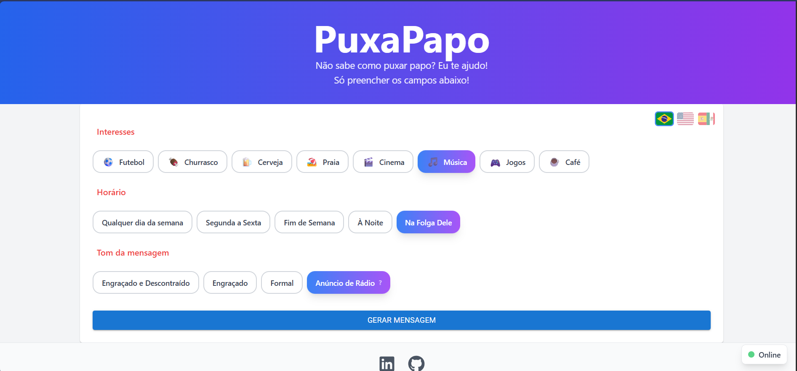
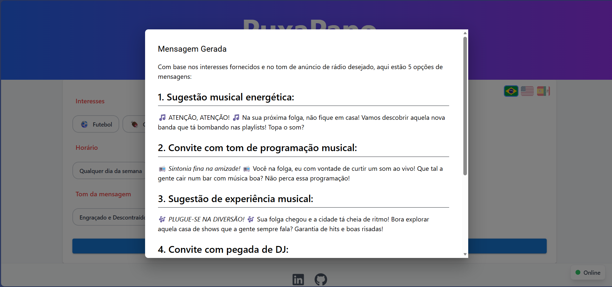

# 💬 PuxaPapo Web

<div align="center">


## [PuxaPapo Site](https://puxa-papo.vercel.app/)
## [PuxaPapo API](https://github.com/BrunoRafaSilva/PuxaPapoApi/)

**Idiomas / Languages / Idiomas:**
[🇧🇷 Português](README.md) | [🇺🇸 English](README.en.md) | [🇪🇸 Español](README.es.md)

**Não sabe como puxar papo? Eu te ajudo!**

<div align="center">
  
  
</div>

Uma aplicação web inteligente que gera mensagens personalizadas para iniciar conversas com base em interesses, horários e tom de comunicação.

[](https://reactjs.org/)
[](https://www.typescriptlang.org/)
[](https://vitejs.dev/)
[](https://mui.com/)
[](https://tailwindcss.com/)

[Demo](https://puxa-papo.vercel.app/) · [Reportar Bug](https://github.com/BrunoRafaSilva/PuxaPapoWeb/issues) · [Solicitar Feature](https://github.com/BrunoRafaSilva/PuxaPapoWeb/issues)

</div>

---

## 📋 Índice

- [Sobre o Projeto](#-sobre-o-projeto)
- [Funcionalidades](#-funcionalidades)
- [Tecnologias](#-tecnologias)
- [Começando](#-começando)
  - [Pré-requisitos](#pré-requisitos)
  - [Instalação](#instalação)
  - [Executando o Projeto](#executando-o-projeto)
- [Estrutura do Projeto](#-estrutura-do-projeto)
- [Scripts Disponíveis](#-scripts-disponíveis)
- [Internacionalização](#-internacionalização)
- [API](#-api)
- [Contribuindo](#-contribuindo)
- [Licença](#-licença)
- [Contato](#-contato)

---

## 🎯 Sobre o Projeto

**PuxaPapo Web** é uma aplicação moderna e intuitiva que ajuda usuários a gerar mensagens personalizadas para iniciar conversas. Seja para convidar amigos para um churrasco, marcar um happy hour ou simplesmente quebrar o gelo, a aplicação utiliza inteligência artificial para criar mensagens adequadas ao contexto.

### Por que usar o PuxaPapo?

- 🎨 **Personalização Total**: Escolha interesses, horários e o tom da mensagem
- 🌍 **Multilíngue**: Suporte para Português, Inglês e Espanhol
- 🚀 **Interface Moderna**: Design responsivo e intuitivo com Material-UI e Tailwind
- ⚡ **Rápido e Eficiente**: Geração instantânea de mensagens via API
- 📱 **Responsivo**: Funciona perfeitamente em desktop, tablet e mobile

---

## ✨ Funcionalidades

### 🎯 Seleção de Interesses

Escolha múltiplos interesses para personalizar sua mensagem:

- ⚽ Futebol
- 🍖 Churrasco
- 🍺 Cerveja
- 🏖️ Praia
- 🎬 Cinema
- 🎵 Música
- 🎮 Jogos
- ☕ Café

### ⏰ Períodos Disponíveis

Defina quando você quer se encontrar:

- 📅 Qualquer dia da semana
- 💼 Segunda a Sexta
- 🎉 Fim de Semana
- 🌙 À Noite
- 🏖️ Na Folga

### 🎭 Tons de Mensagem

Escolha o estilo da sua mensagem:

- 😄 Engraçado e Descontraído
- 🤣 Engraçado
- 👔 Formal
- 📻 Anúncio de Rádio

### 🌐 Idiomas Suportados

- 🇧🇷 Português (Brasil)
- 🇺🇸 Inglês (EUA)
- 🇪🇸 Espanhol (Espanha)

### 🔔 Funcionalidades Adicionais

- ✅ Monitoramento de status da API em tempo real
- 📝 Preview da mensagem gerada em Markdown
- 🎨 Tema claro otimizado para leitura
- ⚠️ Validações e feedbacks visuais
- 🔄 Atualização automática do status da API

---

## 🛠 Tecnologias

Este projeto foi construído com as seguintes tecnologias:

### Core

- **[React 19.1.1](https://reactjs.org/)** - Biblioteca JavaScript para interfaces
- **[TypeScript 5.9.3](https://www.typescriptlang.org/)** - Superset tipado do JavaScript
- **[Vite 7.1.14](https://vitejs.dev/)** - Build tool ultrarrápido

### UI/UX

- **[Material-UI 7.3.4](https://mui.com/)** - Componentes React com Material Design
- **[TailwindCSS 3.4.18](https://tailwindcss.com/)** - Framework CSS utility-first
- **[React Icons 5.5.0](https://react-icons.github.io/react-icons/)** - Biblioteca de ícones

### Internacionalização

- **[i18next 25.6.2](https://www.i18next.com/)** - Framework de internacionalização
- **[react-i18next 16.3.3](https://react.i18next.com/)** - Integração do i18next com React
- **[flag-icons 7.5.0](https://flagicons.lipis.dev/)** - Ícones de bandeiras SVG

### Markdown & Formatação

- **[@uiw/react-markdown-preview 5.1.5](https://uiwjs.github.io/react-markdown-preview/)** - Preview de Markdown com tema

### Roteamento

- **[React Router DOM 7.9.5](https://reactrouter.com/)** - Roteamento para React

### Ferramentas de Desenvolvimento

- **[ESLint 9.36.0](https://eslint.org/)** - Linter para JavaScript/TypeScript
- **[Prettier 3.6.2](https://prettier.io/)** - Formatador de código
- **[PostCSS 8.5.6](https://postcss.org/)** - Ferramenta para transformar CSS
- **[Autoprefixer 10.4.21](https://github.com/postcss/autoprefixer)** - Plugin PostCSS para adicionar prefixos vendor

---

## 🚀 Começando

### Pré-requisitos

Antes de começar, você precisará ter instalado em sua máquina:

- **Node.js** (versão 18.x ou superior)
- **npm** ou **yarn**
- **Git**

```bash
# Verifique as versões instaladas
node --version
npm --version
git --version
```

### Instalação

1. **Clone o repositório**

```bash
git clone https://github.com/BrunoRafaSilva/PuxaPapoWeb.git
```

2. **Acesse a pasta do projeto**

```bash
cd PuxaPapoWeb
```

3. **Instale as dependências**

```bash
npm install
```

### Executando o Projeto

#### Modo Desenvolvimento

```bash
npm run dev
```

A aplicação estará disponível em `http://localhost:5173`

#### Build para Produção

```bash
npm run build
```

Os arquivos otimizados serão gerados na pasta `dist/`

#### Preview da Build

```bash
npm run preview
```

Visualize a build de produção localmente

---

## 📁 Estrutura do Projeto

```
PuxaPapoWeb/
├── public/
│   └── robots.txt              # Configuração para crawlers
├── src/
│   ├── assets/                 # Imagens e recursos estáticos
│   ├── Components/             # Componentes reutilizáveis
│   │   ├── ApiStatus.tsx       # Indicador de status da API
│   │   ├── ChipSelect.tsx      # Seletor de chips customizado
│   │   ├── Header.tsx          # Cabeçalho da aplicação
│   │   ├── LabelOption.tsx     # Label para opções
│   │   ├── ResultModal.tsx     # Modal de resultado
│   │   └── Footer.tsx          # Rodapé com links sociais
│   ├── Constants/              # Constantes e configurações
│   │   ├── ConstantLabelsOptions.tsx
│   │   ├── ConstantLanguageOptions.tsx
│   │   └── ConstantValidationErrors.tsx
│   ├── i18n/                   # Internacionalização
│   │   ├── config.ts           # Configuração do i18next
│   │   └── locales/            # Arquivos de tradução
│   │       ├── en-US.json
│   │       ├── es-ES.json
│   │       └── pt-BR.json
│   ├── pages/                  # Páginas da aplicação
│   │   ├── Index.tsx           # Página principal
│   │   └── NotFound.tsx        # Página 404
│   ├── Services/               # Serviços e integrações
│   │   └── ApiConnectionService.tsx
│   ├── App.tsx                 # Componente raiz
│   ├── App.css                 # Estilos globais do app
│   ├── index.css               # Estilos globais base
│   └── main.tsx                # Ponto de entrada
├── eslint.config.js            # Configuração do ESLint
├── index.html                  # Template HTML
├── package.json                # Dependências e scripts
├── postcss.config.js           # Configuração PostCSS
├── tailwind.config.js          # Configuração Tailwind
├── tsconfig.json               # Configuração TypeScript
├── tsconfig.app.json           # Config TypeScript (app)
├── tsconfig.node.json          # Config TypeScript (node)
└── vite.config.ts              # Configuração Vite
```

---

## 📜 Scripts Disponíveis

| Script            | Descrição                            |
| ----------------- | ------------------------------------ |
| `npm run dev`     | Inicia o servidor de desenvolvimento |
| `npm run build`   | Gera build de produção otimizado     |
| `npm run preview` | Preview da build de produção         |
| `npm run lint`    | Executa o linter no código           |

---

## 🌐 Internacionalização

A aplicação suporta três idiomas:

### Estrutura dos Arquivos de Tradução

```json
{
  "header": {
    "title": "PuxaPapo",
    "subtitle1": "Não sabe como puxar papo? Eu te ajudo!",
    "subtitle2": "Só preencher os campos abaixo!"
  },
  "form": {
    "interests": { ... },
    "period": { ... },
    "tone": { ... }
  },
  "modal": {
    "title": "Mensagem Gerada",
    "closeButton": "Fechar"
  }
}
```

### Adicionando Novos Idiomas

1. Crie um novo arquivo JSON em `src/i18n/locales/`
2. Adicione o idioma em `src/i18n/config.ts`
3. Adicione a bandeira em `src/Constants/ConstantLanguageOptions.tsx`

---

## 🔌 API

A aplicação se conecta a uma API para gerar as mensagens. O serviço está implementado em `src/Services/ApiConnectionService.tsx`.

### Endpoints

#### Health Check

```typescript
GET / health;
Response: {
  status: "online" | "offline";
}
```

#### Gerar Mensagem

```typescript
POST /generate
Body: {
  interest: string[],
  period: string,
  tone: string,
  language: string
}
Response: string (Markdown)
```

### Configurando a URL da API

Edite o arquivo `src/Services/ApiConnectionService.tsx`:

```typescript
const API_BASE_URL = "https://sua-api.com";
```

---

## 🤝 Contribuindo

Contribuições são sempre bem-vindas! Se você quer contribuir com o projeto:

1. Fork o projeto
2. Crie uma branch para sua feature (`git checkout -b feature/AmazingFeature`)
3. Commit suas mudanças (`git commit -m 'Add some AmazingFeature'`)
4. Push para a branch (`git push origin feature/AmazingFeature`)
5. Abra um Pull Request

### Padrões de Código

- Use TypeScript para type safety
- Siga os padrões do ESLint configurados
- Documente componentes complexos
- Escreva mensagens de commit descritivas

---

## 📄 Licença

Este projeto está sob a licença MIT. Veja o arquivo `LICENSE` para mais detalhes.

---

## 👤 Contato

**Bruno Silva**

- 💼 LinkedIn: [brunorlsilva](https://www.linkedin.com/in/brunorlsilva/)
- 🐙 GitHub: [BrunoRafaSilva](https://github.com/BrunoRafaSilva)

---

<div align="center">

**[⬆ Voltar ao topo](#-puxapapo-web)**

Feito com ❤️ por [Bruno Silva](https://github.com/BrunoRafaSilva)

</div>
